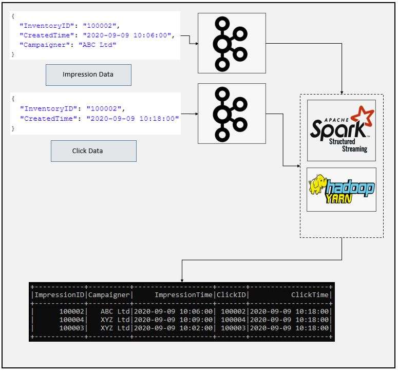

# SparkStream Join 2 Stream Data Example
### Dataflow Pipeline


### Summary

In this application we have 2 different data first data is advertise campaign data which shows inventory and creation data for advertise on random website. Second data is generated when someone clicked this advertisement. We will collect 2 data with kafka topics and read those data using spark applications, we will join matched data and generate results. This is good example to show stream to stream join for spark streamin application.

Here is the first data which shows information about adversitement campaign

```json
{
  "InventoryID": "100001",
  "CreatedTime": "2020-09-09 10:00:00",
  "Campaigner": "ABC Ltd"
}
```

Here is another data shows click results

```json
{
  "InventoryID": "100001",
  "CreatedTime": "2020-09-09 10:18:00"
}
```

### Task List

- [x] Create kafka topics
```
/home/enes/Software/kafka_2.12-2.7.0/bin/kafka-topics.sh --create --zookeeper localhost:2181 --replication-factor 1 --partitions 1 --topic impressions
/home/enes/Software/kafka_2.12-2.7.0/bin/kafka-topics.sh --create --zookeeper localhost:2181 --replication-factor 1 --partitions 1 --topic clicks
```

- [x] Create spark session and define cassandra configuration (You can use ".master("local[*])" instead of yarn if you are running Spark on standalone mode")
```
# Create spark session
if __name__ == "__main__":
    spark = SparkSession \
        .builder \
        .appName("2 Stream Join") \
        .master("yarn") \
        .config("spark.streaming.stopGracefullyOnShutdown", "true") \
        .config("spark.sql.shuffle.partitions", 2) \
        .getOrCreate()
```
- [x] Define schema for impression and click data
```
# Define schema for impression data
    impressionSchema = StructType([
        StructField("InventoryID", StringType()),
        StructField("CreatedTime", StringType()),
        StructField("Campaigner", StringType())
    ])

# Define schema for click data
    clickSchema = StructType([
        StructField("InventoryID", StringType()),
        StructField("CreatedTime", StringType())
    ])
```
- [x] Read data from kafka source and deserialize
```
# Read stream from kafka topic
    kafka_impression_df = spark.readStream \
        .format("kafka") \
        .option("kafka.bootstrap.servers", "localhost:9092") \
        .option("subscribe", "impressions") \
        .option("startingOffsets", "earliest") \
        .load()

# Deserialize and make initial transformation to create impression dataframe
    impressions_df = kafka_impression_df \
        .select(from_json(col("value").cast("string"), impressionSchema).alias("value")) \
        .selectExpr("value.InventoryID as ImpressionID", "value.CreatedTime", "value.Campaigner") \
        .withColumn("ImpressionTime", to_timestamp(col("CreatedTime"), "yyyy-MM-dd HH:mm:ss")) \
        .drop("CreatedTime")

```
- [x] Read second data from another kafka source and deserialize
```
# Read stream from kafka topic
    kafka_click_df = spark \
        .readStream \
        .format("kafka") \
        .option("kafka.bootstrap.servers", "localhost:9092") \
        .option("subscribe", "clicks") \
        .option("startingOffsets", "earliest") \
        .load()

# Deserialize and make initial transformation to create click dataframe
    clicks_df = kafka_click_df.select(
        from_json(col("value").cast("string"), clickSchema).alias("value")) \
        .selectExpr("value.InventoryID as ClickID", "value.CreatedTime") \
        .withColumn("ClickTime", to_timestamp(col("CreatedTime"), "yyyy-MM-dd HH:mm:ss")) \
        .drop("CreatedTime")

```
- [x] Define join conditions and join data on id
```
# Define join conditions
    join_expr = "ImpressionID == ClickID"
    join_type = "inner"

# Join both streaming data
    joined_df = impressions_df.join(clicks_df, expr(join_expr), join_type)

```

- [x] Write data into console
```
# Write output dataframe to console
    output_query = joined_df.writeStream \
        .format("console") \
        .outputMode("append") \
        .option("checkpointLocation", "Stream/chk-point-dir") \
        .trigger(processingTime="1 minute") \
        .start()

    output_query.awaitTermination()
```

### Code Description

spark_kafka_streams_join.py is spark script to read data from kafka sources and implement join transformations to observe and track campaign performance by matching click event with impression event.

### Running

1. Create kafka topics

2. Run kafka-console producer
```
/home/enes/Software/kafka_2.12-2.7.0/bin/kafka-console-producer.sh --broker-list localhost:9092 --topic clicks
/home/enes/Software/kafka_2.12-2.7.0/bin/kafka-console-producer.sh --broker-list localhost:9092 --topic impressions
```

3. Send impression and click data using kafka console producer

4. Check console for output


